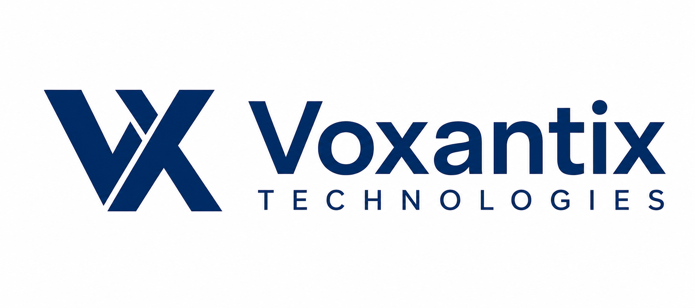

<picture>
  <source media="(prefers-color-scheme: dark)" srcset="voxantix-banner-dark.png" />
  
</picture>

 
 

&nbsp;&nbsp;

 
 

# AI-first software product studio

We design and build <b>AI products</b>, <b>SaaS platforms</b>, <b>custom software</b>, and
 
cross-platform <b>mobile apps</b> — from first prototype to production.

 

&nbsp;

&nbsp;

 
 

 
 

 

<table>
  <tr>
    <td width="50%" valign="top">

<b></b>

### AI Products &amp; Agents

LLM-powered products, autonomous agents, and intelligent workflows built on a production-grade foundation.

</td>
    <td width="50%" valign="top">

<b></b>

### SaaS Platforms

Multi-tenant web platforms with the billing, auth, and observability real customers depend on.

</td>
  </tr>
  <tr>
    <td width="50%" valign="top">

<b></b>

### Custom Software

Bespoke systems and internal tooling engineered around the way your business actually runs.

</td>
    <td width="50%" valign="top">

<b></b>

### Mobile Apps

Cross-platform iOS and Android apps from a single codebase, tuned for a native feel.

</td>
  </tr>
</table>

 

 

<table>
  <tr>
    <td width="33%" valign="top" align="center">

### Prototype first

We validate the idea with a working prototype before committing to the full build.

</td>
    <td width="33%" valign="top" align="center">

### Ship in weeks, not quarters

Tight scopes and fast iteration get product in front of real users while it still matters.

</td>
    <td width="33%" valign="top" align="center">

### Built to last

Typed, tested, and documented — engineered to be handed off and scaled with confidence.

</td>
  </tr>
</table>

 

 

<table>
  <tr>
    <td width="120" valign="middle" align="right">

<b>FRONTEND</b>

</td>
    <td valign="middle" align="left">

</td>
  </tr>
  <tr>
    <td width="120" valign="middle" align="right">

<b>BACKEND</b>

</td>
    <td valign="middle" align="left">

</td>
  </tr>
  <tr>
    <td width="120" valign="middle" align="right">

<b>AI &amp; DATA</b>

</td>
    <td valign="middle" align="left">

</td>
  </tr>
  <tr>
    <td width="120" valign="middle" align="right">

<b>INFRA</b>

</td>
    <td valign="middle" align="left">

</td>
  </tr>
</table>

 

<!-- ===================================================================
     SELECTED WORK  —  TODO: fill in once we have shippable references.
     Uncomment this block and replace the placeholder rows below.

 

<table>
  <tr>
    <td width="50%" valign="top">

### Project name

One line on the problem and the outcome.
 
<a href="#">Live</a> · <a href="#">Case study</a>

</td>
    <td width="50%" valign="top">

### Project name

One line on the problem and the outcome.
 
<a href="#">Live</a> · <a href="#">Case study</a>

</td>
  </tr>
</table>

     =================================================================== -->

 

 
 

### Have a product idea worth building?

 
 

© 2026 Voxantix Technologies&nbsp;&nbsp;·&nbsp;&nbsp;<a href="https://voxantix.com">voxantix.com</a>&nbsp;&nbsp;·&nbsp;&nbsp;All rights reserved.

